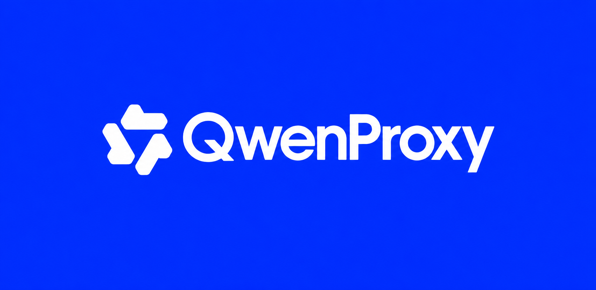
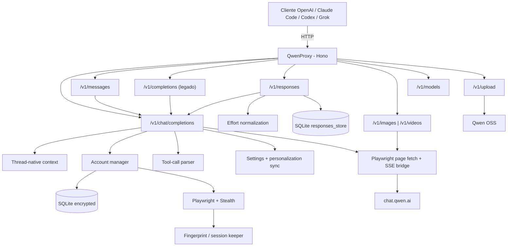

<p align="center">

  

</p>
<p align="center">
  <a href="README.md">English</a> ·
  <b>Português</b> ·
  <a href="README.es.md">Español</a>
</p>


Gateway e API de alta performance compatível com **OpenAI** e **Anthropic** que conecta clientes e agentes (Codex, Claude Code CLI, Grok, Cursor) ao **Qwen (`chat.qwen.ai`)** com suporte a múltiplas contas, failover inteligente, tool calling robusto, thread-native, geração de fotos e vídeos, **Responses API completa com memória persistente** e sessões persistentes. Inclui Playwright com stealth, retries para erros transitórios, variantes públicas base/`-fast`/`-thinking`, cache comprimido, registro de capabilities por modelo e observabilidade.

[](https://github.com/johngbl/QwenProxy/actions/workflows/ci.yml)
[](https://www.npmjs.com/package/qwenproxy-cli)
[](https://www.typescriptlang.org/)
[](https://hono.dev/)
[](https://github.com/kaliiiiiiiiii/patchright)
[](LICENSE)
[](https://github.com/sponsors/johngbl)
[](https://ko-fi.com/johngbl)

## ❤️ Apoie o projeto

Se o **QwenProxy** está sendo útil para você ou sua equipe e você deseja incentivar o desenvolvimento contínuo, novas integrações, testes ao vivo e atualizações rápidas, considere apoiar voluntariamente:

<a href="https://github.com/sponsors/johngbl" target="_blank"></a> <a href="https://ko-fi.com/johngbl" target="_blank"></a>

Toda contribuição é muito bem-vinda e ajuda a cobrir custos de infraestrutura e contas de teste!

---

## 🚀 Principais funcionalidades

- **Compatibilidade Nativa OpenAI & Anthropic** — `/v1/chat/completions`, `/v1/models`, `/v1/messages` (**Anthropic Messages API nativa** para **Claude Code CLI** e SDK oficial), `/v1/messages/count_tokens`, **OpenAI Responses API** (`/v1/responses`) e `/v1/completions` (legado).
- **Matriz de 4 Modos de Conversação** — `thread` (padrão persistente), `thread-temp` (delta ~1KB efêmero, recomendado para agentes), `stateless-temp` (OpenAI oficial completo, efêmero) e `stateless` (OpenAI oficial completo, salvo na conta).
- **Controle Dinâmico de Modos em Tempo Real** — Alterne o modo da API global instantaneamente pela TUI (tecla `M` na tela inicial ou `F4` no Chat) ou via endpoint `/v1/chat/mode`, sem reiniciar o proxy.
- **Dashboard TUI Completo no Terminal (`qpx`)** — Interface visual com suporte total a mouse (hover, clique, arrasto e scroll), seleção vertical de modelos e modos, e título de terminal nativo `QwenProxy`.
- **Importação de Contas em Lote (`B`)** — Cole dezenas de contas de uma vez (`email:senha`, formato `.env`, tab, pipe). Criptografia at-rest em transação SQLite única (<10ms) com deduplicação e contagem em tempo real.
- **Rolagem Dinâmica de Viewport** — Navegação suave em listas de 50+ contas sem estourar o tamanho da janela nem desalinhamento de colunas.
- **Sincronizador Automático de Clientes (`qpx sync`)** — Configuração em 1 clique para Claude Code, OpenAI Codex, OpenCode, Cline, OMP, Zed, Kilo Code e Hermes com backup e restauração.
- **Instância Única de Chromium Ultra-Leve** — 1 único processo de navegador com aceleração WebGL ativa e isolamento seguro de `BrowserContext` (~200MB de RAM para todas as contas, economia >65%).
- **Startup Sob Demanda & Multi-Conta** — Sobe instantaneamente com a primeira conta pronta; contas reservas permanecem em *Standby* e inicializam sem esforço sob demanda (failover ou rotação).
- **Sincronização de Personalization Limpa** — System prompts e tools são sincronizados diretamente na personalização da conta (`/settings/personalization`), imitando 100% o cliente web real e evitando gatilhos de WAF/bot.
- **Parser de Tool Calling com Auto-Cura** — Suporta streaming fragmentado, reparo de JSON quebrado, tags unificadas `<qpx_call>`, fuzzy matching de nomes (`readFile` → `read_file`) e auto-retry inteligente.
- **Geração de Fotos e Vídeos** — Endpoints dedicados `/v1/images/generations` e `/v1/videos/generations` com modelos de ponta (`qwen-image-3.0-pro`, `wan3.0-video`, `wan2.7-image-pro`).
- **Observabilidade & Métricas** — Monitoramento em tempo real em `/health`, `/metrics` (Prometheus), watchdog de memória RSS e logs unificados por turno.
---

## Arquitetura



---

### Autenticação

Em loopback, a autenticação é opcional e o token legado
`sk-qwenproxy-local` continua aceito. Se uma `API_KEY` real estiver definida,
as rotas protegidas exigem uma das formas:

- `Authorization: Bearer <API_KEY>` (OpenAI / Responses)
- `x-api-key: <API_KEY>` (clients bearer-style)

QwenProxy utiliza **Patchright com arquitetura de navegador compartilhado**. Um único processo Chromium é mantido aberto com aceleração WebGL ativa, enquanto cada conta opera em um `BrowserContext` isolado com persistência leve em `storage_state.json` (~200MB de RAM para todas as contas).

```env
PLAYWRIGHT_HEADLESS=true
PLAYWRIGHT_BROWSER=chromium
```

**Instalação do navegador:**
O Chromium é instalado automaticamente na primeira execução de `qpx`. Se desejar instalar manualmente:

```bash
npx patchright install chromium
```
Senhas das contas são armazenadas **criptografadas** no SQLite (`data/`).

### Transporte upstream e streaming

No fluxo textual principal, as chamadas ao Qwen são feitas pelo `fetch` executado dentro da página Chromium da conta. Isso mantém cookies, User-Agent, TLS, Origin e fingerprint no mesmo contexto do navegador.

A resposta de completion é consumida com `ReadableStream.getReader()` e encaminhada em chunks ao Bridge. O corpo SSE não é acumulado inteiro antes de ser entregue ao cliente. Personalization usa a página `/settings/personalization`; os demais endpoints de chat usam o mesmo contexto autenticado.

---

## Modelos e contexto

Modelos e janelas de contexto são sincronizados em tempo real pelo catálogo `/api/models` do Qwen, separadamente para cada conta. O QwenProxy não mantém uma tabela de nomes/capabilities: modelos novos aparecem automaticamente em `/v1/models`, e o objeto `info.meta` recebido do upstream é preservado.

Exemplos do catálogo atual (podem mudar sem release do proxy):


| Modelo                    | Contexto      | Output máximo | Thinking | Vision |
| ------------------------- | -------------: | -------------: | :--------: | :------: |
| `qwen3.8-max`             | 1.000.000     | 131.072       | ✅        | ✅      |
| `qwen3.7-plus`            | 1.000.000     | 65.536        | ✅        | ✅      |
| `qwen3.7-max`             | 1.000.000     | 65.536        | ✅        | ❌      |
| **Fallback desconhecido** | **1.048.576** | **65.536**    | —        | —      |


O fallback é usado somente quando a conta ainda não sincronizou o catálogo ou o endpoint upstream está indisponível. Depois da sincronização, contexto, output, thinking, modalidades, `think_skip`, `chat_type`, `mcp`, status ativo e demais metadata vêm do Qwen.

> **Nota:** O endpoint `/v1/models` retorna capabilities dinâmicas (formato OpenAI).

### Capabilities

Cada modelo tem um registro `ModelCapabilities` em `src/core/model-registry.ts`:

```ts
interface ModelCapabilities {
  maxOutputTokens: number;
  maxThinkingTokens: number;
  supportsThinking: boolean;
  supportsVision: boolean;
  canSkipThinking: boolean;
  supportsDocument: boolean;
  supportsAudio: boolean;
  supportsVideo: boolean;
  supportsCitations: boolean;
  supportsCodeExecution: boolean;
  supportsStructuredOutputs: boolean;
  modalities: string[];
  chatTypes: string[];
  mcp: string[];
  isActive: boolean;
}
```

**Destaque `qwen3.8-max`**: modelo flagship com suporte a visão (o `qwen3.7-max` não suporta). Permite desativar thinking (`canSkipThinking: true`).

### Variantes sintéticas

- modelo base — modo **Auto** (o Qwen decide se raciocina), ex.: `qwen3.7-plus`
- `-fast` — Fast com thinking desativado, ex.: `qwen3.7-plus-fast`
- `-thinking` — Thinking forçado, ex.: `qwen3.7-plus-thinking`

As variantes usam a mesma janela de contexto e o mesmo modelo upstream do modelo base; o modo de raciocínio é selecionado pelo `feature_config` do Qwen (Auto/Fast/Thinking). O ID antigo `-no-thinking` não é publicado; é apenas normalizado internamente para `-fast` por compatibilidade legada.

### `reasoning_effort` no Chat Completions

O campo OpenAI `reasoning_effort` (`none`/`minimal`/`low`/`medium`/`high`/`xhigh`/`max`) também é aceito em `/v1/chat/completions`:

- `low`/`none`/`minimal` → força Fast (thinking OFF) quando o modelo **não** tem sufixo
- `medium`/`high`/`xhigh`/`max` → mantém Auto (o Qwen decide, como hoje)
- **Precedência:** um sufixo explícito no modelo (`-fast`/`-thinking`) sempre vence o `reasoning_effort`; ausente o campo, comportamento idêntico ao anterior (no-op)

---

## Responses API (`/v1/responses`)

Implementação completa da OpenAI Responses API com extensões para clientes agentic (Codex, Grok CLI, Cursor).

### Features


| Feature                 | Descrição                                                                                                                                                      |
| ----------------------- | -------------------------------------------------------------------------------------------------------------------------------------------------------------- |
| **SSE fiel**            | `event: <type>` + `data: {...}` com `sequence_number` incremental em todos os eventos                                                                          |
| **Memória persistente** | `previous_response_id` com store SQLite durável (sobrevive restarts, TTL 7 dias)                                                                               |
| `**last_response_id**`  | Retornado em toda response para encadeamento pelo cliente                                                                                                      |
| **Reasoning effort**    | `reasoning.effort` aceita qualquer string; normaliza `xhigh`/`max`/`fast`/`none`/numérico para thinking ON/OFF                                                 |
| **Multimodal**          | `input_image` → `image_url`, `input_file` → `file_url` no chat interno                                                                                         |
| **Usage real**          | `stream_options.include_usage: true`; upstream sobrescreve estimativas; `input_tokens_details` e `output_tokens_details` **sempre** presentes (fix Grok/serde) |
| **Reasoning lifecycle** | `reasoning_summary_part.added` → `reasoning_summary_text.delta` → `reasoning_summary_text.done` → `reasoning_summary_part.done`                                |
| **Error envelope**      | Formato OpenAI: `{ error: { message, type, param, code } }`                                                                                                    |
| **Store**               | `store: false` desativa persistência; GET/DELETE `/v1/responses/:id` para recuperar/remover                                                                    |


### Reasoning effort mapping


| Client effort                                          | Normalizado | Qwen `feature_config`                                                |
| ------------------------------------------------------ | ----------- | -------------------------------------------------------------------- |
| `max`, `high`, `xhigh`, `thinking`, `ultra`, `deep`    | high        | `thinking_enabled: true`, `thinking_mode: "Thinking"`                |
| `medium`, `med`, `default`                             | medium      | thinking ON (mesmo que high)                                         |
| `fast`, `none`, `low`, `off`, `minimal`, `no-thinking` | low         | `thinking_enabled: false`, `thinking_mode: "Fast"` e modelo `*-fast` |
| numérico 0–33                                          | low         | thinking OFF                                                         |
| numérico 34–66                                         | medium      | thinking ON                                                          |
| numérico 67–100                                        | high        | thinking ON                                                          |


> **Nota:** effort `low` sempre seleciona a variante pública `*-fast`; o catálogo pode informar `think_skip`, mas esse metadado não limita a publicação da variante.

### Exemplo: Responses API com memória

```bash
# Primeira request
curl http://localhost:7936/v1/responses \
  -H "Authorization: Bearer local" \
  -H "Content-Type: application/json" \
  -d '{"model":"qwen3.8-max","input":"Meu nome é João","stream":true}'

# Resposta inclui last_response_id: "resp_abc123..."

# Segunda request com memória
curl http://localhost:7936/v1/responses \
  -H "Authorization: Bearer local" \
  -H "Content-Type: application/json" \
  -d '{"model":"qwen3.8-max","input":"Qual meu nome?","previous_response_id":"resp_abc123...","stream":true}'
```

### Exemplo: effort com Codex/Grok

```bash
curl http://localhost:7936/v1/responses \
  -H "Authorization: Bearer local" \
  -H "Content-Type: application/json" \
  -d '{"model":"qwen3.7-max","input":"hi","reasoning":{"effort":"xhigh"},"max_output_tokens":30}'
```

---
## 🔄 Modos de conversação

O QwenProxy oferece uma matriz completa de **4 modos de operação**, permitindo equilibrar economia de tokens, velocidade e organização do histórico:

| Modo | Formato do Envio | Upstream Qwen | Persistência na Conta Web | Caso de Uso Ideal |
| :--- | :--- | :--- | :---: | :--- |
| **`thread-temp`** ⭐ | **Delta (~1KB)** | `chat_mode: "local"` | ❌ Não (Zero poluição) | **O melhor para o dia a dia.** Recomendado para Claude Code, Codex, OpenCode e Cursor. Máxima velocidade, TTFB ultra-baixo e não enche sua conta de chats descartáveis. |
| **`stateless-temp`** | **Histórico Completo** | `chat_mode: "local"` | ❌ Não (Zero poluição) | **Padrão Oficial das APIs (OpenAI/Anthropic).** Envia todas as mensagens a cada turno. Ideal se você costuma editar ou reordenar mensagens antigas durante a sessão. |
| **`thread`** *(Padrão)* | **Delta (~1KB)** | `chat_mode: "normal"` | ✅ Sim (Salva no site) | Ideal se você fizer questão de abrir o site `chat.qwen.ai` no celular ou navegador depois para reler o histórico da conversa. |
| **`stateless`** | **Histórico Completo** | `chat_mode: "normal"` | ✅ Sim (Salva no site) | Envia o histórico completo e mantém as conversas salvas na conta do Qwen. |

### Como alternar os modos:

1. **Pela TUI (Em Tempo Real para todo o Proxy):**
   - **Na tela `[1] Status`:** Pressione a tecla **`M`** (ou clique em `[ M ] Alternar Modo`) para ciclar o modo da API global na hora.
   - **Na tela `[2] Chat`:** Pressione **`F4`** (ou clique no indicador `[ Modo ]`) para abrir o modal de seleção vertical.
2. **Via Endpoint HTTP (Controle Remoto Dinâmico):**
   ```bash
   # Inspecionar modo ativo:
   curl http://127.0.0.1:7936/v1/chat/mode

   # Alterar modo globalmente em tempo real:
   curl -X POST http://127.0.0.1:7936/v1/chat/mode \
     -H "Content-Type: application/json" \
     -d '{"mode":"thread-temp"}'
   ```
3. **Por Requisição (Header HTTP Individual):**
   Envie o header `X-QwenProxy-Chat-Mode: thread-temp` (ou `stateless-temp`, `thread`, `stateless`) em chamadas individuais.
4. **No arquivo `.env` (Padrão de Inicialização):**
   ```env
   QWEN_CHAT_MODE=thread
   ```

---

## 📖 Passo a passo: Como começar do zero

### 1. Instalação

Instale o CLI do QwenProxy globalmente no seu sistema:

```bash
# Via npm:
npm install -g qwenproxy-cli

# Ou via pnpm / bun:
pnpm add -g qwenproxy-cli
# bun add -g qwenproxy-cli
```

### 2. Iniciar o Dashboard Interativo (TUI)

Abra o terminal e execute:

```bash
qpx
```

O QwenProxy inicializa o servidor de alta performance em segundo plano e abre a interface interativa no terminal. O título da janela do terminal será automaticamente definido como **`QwenProxy`**.

### 3. Adicionar Contas Qwen

Na TUI, você pode gerenciar suas contas na aba **`[5] Contas`** de duas formas simples:

- **Importação em Lote (`B`):** Pressione a tecla **`B`** (ou clique em `[ B ] Em Lote`). Cole suas contas de uma só vez (aceita formato `email:senha`, formato bruto do `.env` com vírgulas ou copiado de planilhas). O sistema calcula a contagem em tempo real, valida duplicatas e grava tudo no SQLite criptografado em milissegundos.
- **Adição Individual (`A`):** Pressione a tecla **`A`** para digitar o e-mail e a senha de uma conta específica.
- **Login Manual no Navegador:** Se preferir fazer login visual com captcha manual, execute no terminal: `qpx login`.

### 4. Sincronizar com seus Agentes de IA

Para configurar automaticamente seus editores e CLIs favoritos para usarem o QwenProxy:

```bash
# Sincroniza todos os clientes detectados na sua máquina:
qpx sync

# Ou sincronize clientes específicos:
qpx sync claude codex opencode
```

O sincronizador detecta e configura automaticamente:
- **Claude Code CLI** (`~/.claude/settings.json`) — Usa o protocolo nativo Anthropic (`/v1/messages`).
- **OpenAI Codex CLI** (`~/.codex/config.toml`) — Usa o protocolo nativo Responses (`/v1/responses`).
- **OpenCode** (`~/.config/opencode/opencode.jsonc`) — Configura provider OpenAI-compatible.
- **Cline, OMP, Zed, Kilo Code e Hermes Agent**.
> **Dica de Rollback:** Se quiser desfazer a configuração e restaurar os arquivos originais a qualquer momento, execute `qpx sync --restore` (ou `npm run sync:restore`).
### 5. Pronto para Trabalhar!

Agora basta abrir o seu agente favorito normalmente:
```bash
# Usar o Claude Code:
claude

# Usar o Codex CLI:
codex

# Usar o OpenCode:
opencode
```
Todas as requisições fluem com máxima velocidade, failover automático entre contas e sem custos de API externa!

---

## 💡 Dicas de uso e produção

1. **Use `thread-temp` para Programar no Dia a Dia:**  
   Agentes de desenvolvimento geram dezenas de turnos e chamadas de ferramenta por minuto. Usar o modo `thread-temp` evita que centenas de conversas descartáveis entulhem a sua conta pessoal no `chat.qwen.ai`, mantendo o TTFB na faixa de ~0.6s a 1.2s.
2. **Multi-Contas para Quota Diária Alta:**  
   Adicione 2 ou mais contas no QwenProxy. As cotas do Qwen Web resetam pontualmente às **00:00 UTC**. Se uma conta atingir o limite diário, o proxy a coloca em cooldown automaticamente e faz o failover instantâneo para a próxima conta saudável.
3. **Limpeza Periódica de Perfis (`qpx clean`):**  
   Com o tempo de uso contínuo, o Chromium acumula cache de renderização V8/GPU. Execute `qpx clean` para purgar caches descartáveis, reduzindo o tamanho de cada perfil de ~300MB para apenas **~4.5MB**, preservando 100% os cookies e sessões ativas.
4. **Zerar Cooldowns na TUI:**  
   Se você quiser forçar a revalidação imediata de contas em cooldown, vá até a aba **`[1] Status`** e pressione **`Z`** (ou use `qpx reset`).

## Pré-requisitos


| Dependência | Versão mínima | Observação                           |
| ----------- | -------------: | ------------------------------------ |
| Node.js     | 22+           | Conforme `engines` do `package.json` |
| npm         | 9+            | Incluído com Node                    |
| Playwright  | -             | `npx playwright install chromium`    |
| Docker      | opcional      | Deploy em container                  |


---

## Instalação e Execução

O QwenProxy pode ser instalado globalmente, executado instantaneamente via `npx`/`bunx`, ou clonado localmente:

### Opção 1: Instalação Global (Recomendado)
Instale uma única vez para ter acesso ao comando rápido **`qpx`** de qualquer lugar do terminal:
```bash
# Via npm:
npm install -g qwenproxy-cli

# Ou via pnpm:
pnpm add -g qwenproxy-cli

# Ou via bun:
bun add -g qwenproxy-cli
```
Após instalar, basta abrir o terminal e digitar:
```bash
qpx
# ou: qwenproxy
```
*(Abre diretamente o dashboard interativo da TUI com o servidor e proxy integrados).*

#### Comandos Rápidos do CLI (`qpx`)

| Comando | Descrição |
| :--- | :--- |
| `qpx` *(ou `qwenproxy`)* | Abre o dashboard visual interativo da TUI com servidor proxy integrado |
| `qpx start` *(ou `--server`)* | Inicia apenas o servidor HTTP/SSE em modo headless (sem interface gráfica) |
| `qpx update` | Verifica e atualiza o QwenProxy automaticamente via npm/pnpm/bun |
| `qpx login` | Abre navegador visível para autenticar novas contas interativamente |
| `qpx sync` | Configura e sincroniza clientes (Claude Code, Codex, OpenCode, OMP) |
| `qpx clean` | Limpa caches temporários dos perfis Chromium (~4.5MB por conta) |
| `qpx clean:all` | Limpa caches e remove versões antigas de navegadores órfãos em disco |
| `qpx purge` | Limpa o histórico de conversas remotas no Qwen de todas as contas |
| `qpx reset` | Reseta cooldowns e rate limits salvos no banco de dados |
### Opção 2: Execução Instantânea (Zero Instalação)
Experimente ou execute pontualmente sem instalar nada permanentemente:
```bash
npx qwenproxy-cli
# ou: bunx qwenproxy-cli
```

### Opção 3: Clonando o Código (Desenvolvimento)
```bash
git clone https://github.com/johngbl/qwenproxy.git
cd qwenproxy
npm install
npm run tui      # Abre a TUI interativa
# ou: npm start  # Inicia apenas o servidor HTTP headless
```

### Opção 4: Via Docker
```bash
docker-compose up -d
```
---

## Início rápido

Crie um `.env` na raiz (use `.env.example` como base).

### Exemplo mínimo

```env
QWEN_ACCOUNTS=user1@example.com:senha1;user2@example.com:senha2
API_KEY=sua-chave-local
HOST=127.0.0.1
```

> **Dica:** use `;` como separador de contas (`,` legado ainda funciona).  
> Senhas com `:`, `#` e espaços são aceitas.

### Iniciar

```bash
npm start
```

> **Nota:** o servidor não inicia sem pelo menos uma conta configurada (via `.env`/`QWEN_ACCOUNTS`, `npm run login` ou banco de contas).

1. O servidor inicia instantaneamente com a **primeira conta pronta** para responder requisições imediatamente.
2. Com `PLAYWRIGHT_PREPARE_ALL_ON_STARTUP=false` (padrão econômico), as contas adicionais permanecem em **Standby**, com credenciais validadas no banco, sendo inicializadas apenas sob demanda (failover ou rotação), poupando RAM e CPU.
3. Todas as contas ativas compartilham a mesma instância Chromium única, mantendo sessões isoladas via `BrowserContext` e arquivos leves de estado `storage_state.json`.
4. O watchdog RSS do sistema monitora a pressão de memória e fecha contextos ociosos automaticamente.
Exemplo de log:

```text
✅ [Server] Account ready (1/6): us***@example.com
🪶 [Server] Preparing 5 standby account(s) in background
✅ [Server] Account ready (2/6): us***@example.com
...

+----------------------------------------------------------+
|                        QwenProxy                         |
|           OpenAI & Anthropic Compatible API              |
|  Endpoint    http://127.0.0.1:7936/v1                    |
|  Accounts    1/6 warm                                    |
|  Status      ● Online                                    |
+----------------------------------------------------------+
```

---

## Testes

```bash
npm test           # mock + live
npm run test:mock  # suite mock (sem browser real de contas)
npm run test:live  # stress/concurrency reais
npm run typecheck  # tipos
```

---

## Variáveis de ambiente

### Rede e segurança


| Variável     | Default     | Descrição |
| ------------ | ----------- | --------- |
| `PORT`       | `7936`      | Porta HTTP (padrão QWEN: 7936). Configurável via .env |
| `HOST`       | `127.0.0.1` | Bind host. Fora de loopback exige uma chave forte |
| `API_KEY`    | vazio       | Opcional em loopback; protege as rotas com Bearer token |
| `CORS_ORIGIN`| vazio       | Sem valor, permite apenas origens web de loopback |


### Contas e sessão


| Variável                            | Default        | Descrição                                                                                                                                                                                                                                                        |
| ----------------------------------- | -------------- | ---------------------------------------------------------------------------------------------------------------------------------------------------------------------------------------------------------------------------------------------------------------- |
| `QWEN_ACCOUNTS`                     | vazio          | `email1:senha1;email2:senha2`                                                                                                                                                                                                                                    |
| `DELETE_ALL_CHATS_ON_SHUTDOWN`      | `false`        | Limpa chats no shutdown                                                                                                                                                                                                                                          |
| `QWEN_PERSONALIZATION_FROM_REQUEST` | `true`         | Envia system + tools via `/settings/personalization`                                                                                                                                                                                                             |
| `QWEN_PERSONALIZATION_VERIFY_GET`   | `true`         | Confirma personalization com GET                                                                                                                                                                                                                                 |
| `QWEN_MAX_PERSONALIZATION_BYTES`    | `500000`       | Teto UTF-8 para personalization por request (500KB); acomoda centenas de MCP tools com folga                                                                                                                                                                     |
| `QWEN_CHAT_POOL_SIZE`               | `1`            | Warm pool de chats por modelo; fica desativado quando personalization por request está ativa                                                                                                                                                                     |
| `QWEN_CHAT_POOL_MODELS`             | `qwen3.7-plus` | Modelos aquecidos no warm pool                                                                                                                                                                                                                                   |
| `QWEN_CHAT_MODE`                    | `thread`       | Modo de conversa padrão: `thread`, `thread-temp`, `stateless` ou `stateless-temp`. Override dinâmico via TUI (`M`/`F4`), HTTP (`/v1/chat/mode`) ou header `X-QwenProxy-Chat-Mode`. |


### Playwright / processos


| Variável                                    | Default    | Descrição                                                                                                                                                                        |
| ------------------------------------------- | ---------- | -------------------------------------------------------------------------------------------------------------------------------------------------------------------------------- |
| `PLAYWRIGHT_HEADLESS`                       | `true`     | Browser sem janela                                                                                                                                                               |
| `PLAYWRIGHT_BROWSER`                        | `chromium` | `chromium` / `chrome` / `edge`                                                                                                                                                   |
| `PLAYWRIGHT_INIT_BATCH_SIZE`                | `1`        | Contas em paralelo no background init                                                                                                                                            |
| `PLAYWRIGHT_PREPARE_ALL_ON_STARTUP`         | `false`    | Prepara somente a primeira conta no boot (`false` = modo econômico sob demanda; `true` = aquece todas)                                                                           |
| `PLAYWRIGHT_MAX_ACTIVE_CONTEXTS`            | `2`        | Contextos idle mantidos quentes ({principal + reserva}); streams ativos nunca são fechados; uso simultâneo abre mais. Contas em cooldown (rate limit) ficam idle e são evictadas |
| `PLAYWRIGHT_CONTEXT_CLOSE_TIMEOUT_MS`       | `10000`    | Timeout de close antes do kill                                                                                                                                                   |
| `PLAYWRIGHT_IDLE_CONTEXT_TTL_MS`            | `60000`    | Fecha contextos idle acima do cap (`0` desativa)                                                                                                                                 |
| `PLAYWRIGHT_JS_HEAP_MB`                     | `256`      | Cap V8 do Chromium (`--max-old-space-size`)                                                                                                                                      |
| `PLAYWRIGHT_LOW_MEMORY_FLAGS`               | `true`     | Flags de baixa RAM (heap cap, cache mínimo, renderer limit)                                                                                                                      |
| `OSS_MULTIPART_THRESHOLD_MB`                | `5`        | Acima disso usa multipart OSS; abaixo `putStream`                                                                                                                                |
| `SESSION_KEEP_ALIVE_ENABLED`                | `true`     | Simula navegações leves periódicas a cada 3min para manter sessões ativas sem desconectar                                                                                        |
| `SESSION_KEEP_ALIVE_INTERVAL_MS`            | `180000`   | Intervalo do ciclo de keep-alive/cleanup                                                                                                                                         |
| `SESSION_KEEP_ALIVE_IDLE_MS`                | `120000`   | Idle mínimo para keep-alive                                                                                                                                                      |
| `SESSION_KEEP_ALIVE_NAVIGATION_INTERVAL_MS` | `480000`   | Intervalo de navegação leve                                                                                                                                                      |


### CAPTCHA automático


| Variável                        | Default  | Descrição                                                                              |
| ------------------------------- | -------- | -------------------------------------------------------------------------------------- |
| `CAPTCHA_SOLVER_ENABLED`        | `true`   | Solver Baxia/TMD ativo por padrão; use `false` somente como desligamento de emergência |
| `CAPTCHA_SOLVER_MAX_ATTEMPTS`   | `3`      | Máximo de arrastos por challenge                                                       |
| `CAPTCHA_SOLVER_TIMEOUT_MS`     | `15000`  | Tempo para o iframe Baxia aparecer                                                     |
| `CAPTCHA_SOLVER_RETRY_DELAY_MS` | `1000`   | Espera entre tentativas do slider                                                      |
| `CAPTCHA_SOLVER_SETTLE_MS`      | `2000`   | Tempo para confirmar cookies/DOM após o arrasto                                        |
| `CAPTCHA_ACCOUNT_COOLDOWN_MS`   | `120000` | Cooldown da conta quando o desafio não pôde ser resolvido; `0` desliga                 |


### Headers anti-bot


| Variável          | Default            | Descrição                                                                                                              |
| ----------------- | ------------------ | ---------------------------------------------------------------------------------------------------------------------- |
| `USER_AGENT`      | Chrome 149 Windows | UA fallback                                                                                                            |
| `QWEN_BX_V`       | `2.5.37`           | `bx-v` fallback; `bx-ua`/`bx-umidtoken` **não** são enviados como headers (o cliente real os carrega como cookies WAF) |
| `QWEN_SEND_BX_UA` | `false`            | `true` restaura o comportamento legado de injetar `bx-ua`/`bx-umidtoken` capturados como headers                       |


Fingerprint estável por conta (UA, locale, viewport, hardware/WebGL) é aplicado automaticamente.

### Delays e retry


| Variável                            | Default  | Descrição                                                                                        |
| ----------------------------------- | -------- | ------------------------------------------------------------------------------------------------ |
| `RETRY_BASE_DELAY_MS`               | `1000`   | Base do exponential backoff                                                                      |
| `RETRY_MAX_DELAY_MS`                | `10000`  | Cap do backoff                                                                                   |
| `RETRY_MAX_ATTEMPTS`                | `3`      | Tentativas por request (create-stream + mid-stream)                                              |
| `RETRY_MAX_ACCOUNT_SWITCHES`        | `2`      | Máximo de trocas de conta por request                                                            |
| `RETRY_ON_UNKNOWN_UPSTREAM`         | `true`   | Retry/troca automática em erros upstream desconhecidos (denylist só para erros locais terminais) |
| `RETRY_AUTO_MALFORMED_TOOLS`        | `true`   | Auto-retry quando todos os tool calls da resposta vêm malformados                                |
| `RETRY_AUTO_MALFORMED_TOOLS_MAX`    | `2`      | Máximo de retries de tool calls malformados por resposta                                         |
| `MAX_TOOL_CALLS_PER_TURN`           | `8`      | Teto de tool calls por turno (0 desativa); calls duplicadas idênticas também são descartadas     |
| `CHAT_IN_PROGRESS_RETRY_DELAY_MS`   | `2000`   | Espera antes de repetir no mesmo chat após `chat_in_progress`                                    |
| `CHAT_IN_PROGRESS_BUSY_MS`          | `4000`   | Janela busy da conta após `chat_in_progress` (absorve o settle do upstream)                      |
| `MID_STREAM_FAILOVER_THRESHOLD`     | `2`      | Falhas de rede mid-stream nesta janela marcam a conta temporarily busy                           |
| `MID_STREAM_FAILOVER_BUSY_MS`       | `60000`  | Duração do busy após o threshold mid-stream                                                      |
| `ACQUIRE_DEADLINE_MS`               | `120000` | Deadline por tentativa de acquire do stream (falha visível → troca de conta)                     |
| `ACCOUNT_QUEUE_WAIT_FOREVER_CAP_MS` | `120000` | Cap de espera na fila "sem deadline" de contas                                                   |
| `ACCOUNT_LEASE_MAX_DURATION_MS`     | `600000` | Vida máxima de uma lease de conta                                                                |
| `ACCOUNT_INIT_FAILURE_COOLDOWN_MS`  | `300000` | Cooldown após falha de init de conta                                                             |


### Timeouts


| Variável                   | Default  | Descrição                                                                                        |
| -------------------------- | -------- | ------------------------------------------------------------------------------------------------ |
| `HTTP_TIMEOUT`             | `10000`  | HTTP genérico                                                                                    |
| `CHAT_TIMEOUT`             | `120000` | Timeout de chat                                                                                  |
| `NAVIGATION_TIMEOUT`       | `60000`  | Navegação Playwright                                                                             |
| `PAGE_TIMEOUT`             | `60000`  | Operações de página                                                                              |
| `HEADERS_TIMEOUT`          | `60000`  | Captura de headers                                                                               |
| `TIME_TO_FIRST_BYTE`       | `60000`  | Janela de primeiro byte (teto com piso de 15s no metadata)                                       |
| `IDLE_STREAM_TIMEOUT`      | `60000`  | Stream sem dados (modelos não-reasoning)                                                         |
| `TOTAL_REQUEST_TIMEOUT`    | `600000` | Teto de geração                                                                                  |
| `REASONING_MODEL_TIMEOUT`  | `180000` | Silêncio mid-stream para modelos reasoning (chunks fluidos resetam; zero bytes por 3min = morto) |
| `QWEN_FIRST_CHUNK_TIMEOUT` | `180000` | Deadline do PRIMEIRO chunk (thought = 0 bytes por 3min aborta retryável)                         |


**Nota:** timeouts dinâmicos de payload: **modelos reasoning** usam `REASONING_MODEL_TIMEOUT` (180s default) + 30s por MB; **modelos não-reasoning** usam `IDLE_STREAM_TIMEOUT` (60s default) + 30s por MB.

### Cache e contexto


| Variável                      | Default | Descrição                                                                                                                 |
| ----------------------------- | ------- | ------------------------------------------------------------------------------------------------------------------------- |
| `CACHE_TTL`                   | `3600`  | TTL do cache (s)                                                                                                          |
| `CACHE_COMPRESSION_ENABLED`   | `true`  | Compressão Brotli                                                                                                         |
| `QWEN_MAX_PROMPT_BYTES`       | `0`     | Teto opcional local UTF-8 do prompt (`0` desativa); não é a janela de tokens. O payload total continua limitado a 50 MiB  |
| `CONTEXT_METER_ENABLED`       | `true`  | Medição do histórico completo, delta/replay, payload Qwen e percentuais de contexto; já vem ativa por padrão              |
| `CONTEXT_METER_WINDOW_TOKENS` | `0`     | Janela usada pelo medidor (`0` usa a janela real registrada para o modelo)                                                |
| `CONTEXT_METER_REPORT_USAGE`  | `true`  | Reporta em `usage.prompt_tokens` o valor real `input_tokens` do Qwen quando disponível; só usa a estimativa como fallback |


O medidor de contexto é padrão e não exige nenhuma variável no `.env`. Ele não é um tokenizer nativo do Zed/Cline nem substitui o tokenizer privado do Qwen: calcula uma estimativa local do histórico completo recebido pelo proxy, registra o prompt delta/replay efetivamente enviado e preserva `usage.context_meter` com `measurementSource=qwen` quando o Qwen devolve `input_tokens`, ou `measurementSource=local_estimate` quando não devolve. A janela do modelo é sincronizada automaticamente pelo `/api/models`, e são emitidos headers `X-QwenProxy-Context-*` e logs estruturados. As três variáveis podem ser usadas somente como overrides avançados; por padrão o valor real do Qwen é preferido e a estimativa só é fallback.

### Observabilidade


| Variável              | Default  | Descrição                                                                       |
| --------------------- | -------- | ------------------------------------------------------------------------------- |
| `CHAT_REQUEST_LOG`    | `false`  | Logs detalhados de request                                                      |
| `LOG_LEVEL`           | `warn`   | Nível do logger (`debug`/`info`/`warn`/`error`); `TOOLCALL_DEBUG=1` força debug |
| `METRICS_INTERVAL`    | `10000`  | Intervalo de métricas                                                           |
| `WATCHDOG_INTERVAL`   | `5000`   | Intervalo do watchdog                                                           |
| `RAM_WARNING`         | `80`     | % RSS warning (RSS / totalmem)                                                  |
| `RAM_CRITICAL`        | `95`     | % RSS critical (RSS / totalmem)                                                 |
| `RATE_LIMIT_REQUESTS` | `5000`   | Header estático `x-ratelimit-limit-requests` (não impõe quota)                  |
| `RATE_LIMIT_TOKENS`   | `200000` | Header estático `x-ratelimit-limit-tokens` (não impõe quota)                    |


---

## Retries e resiliência

O proxy tenta recuperar erros transitórios sem quebrar thread-native/tools:


| Situação                                                     | Comportamento                                                                                                                                        |
| ------------------------------------------------------------ | ---------------------------------------------------------------------------------------------------------------------------------------------------- |
| `502` / `503` / `504`                                        | Retry com delay curto                                                                                                                                |
| `fetch failed`, `ECONNREFUSED`, `ETIMEDOUT`, `ENOTFOUND`     | Retry de rede                                                                                                                                        |
| Anti-bot (`FAIL_SYS_USER_VALIDATE`, captcha, WAF HTML, etc.) | Com solver Baxia habilitado: preserva a página, tenta resolver uma vez, atualiza headers e repete na mesma conta; sem solver, mantém o retry simples |
| Quota / rate limit                                           | Cooldown categorizado (`RateLimited`, `RateLimitTemporary`, …)                                                                                       |
| `invalid_input` (“entrada ou anexo inválido”)                | Retry forçando **novo chat** + contexto completo                                                                                                     |
| Chat not exist / session stale                               | Força novo chat na sessão lógica                                                                                                                     |
| Tool calls malformados (todos inválidos)                     | Reparo local do JSON; se não resolver, auto-retry na mesma conta com novo chat e correção enviada ao modelo (até `RETRY_AUTO_MALFORMED_TOOLS_MAX`)   |
| `INVALID_FIRST_MSG` / histórico corrompido                   | Novo chat + contexto completo na **mesma conta** (a corrupção é da cadeia de parent, não da conta); o thread lógico contaminado é invalidado         |


Settings seguras aplicadas no sync de personalization (sem reescrever tudo da conta):

```json
{
  "ui": { "autoTags": false, "largeTextAsFile": false, "splitLargeChunks": false },
  "mcp_remind": false,
  "memory": { "enable_memory": false, "enable_history_memory": false },
  "tools_enabled": { "web_search": false, "code_interpreter": false }
}
```

---

## Anti-bot

Detecta, entre outros:

- `FAIL_SYS_USER_VALIDATE`
- `RGV587_ERROR`
- mensagens de captcha / human verification

**Fluxo:**

1. Identifica o WAF/captcha sem expor o HTML do desafio ao cliente
2. Se `CAPTCHA_SOLVER_ENABLED=true`, detecta o diálogo Baxia já visível e procura o iframe aninhado, o iframe legado ou o documento NC diretamente na página da mesma conta
3. Se nada estiver visível — o caso normal, porque o completion roda como `fetch` em background e o WAF responde o documento de punish ao XHR em vez de renderizar algo — extrai a URL do desafio do corpo da resposta e abre essa URL na própria página da conta; sem URL utilizável, recarrega a página de chat para forçar o desafio a aparecer. Só a origem configurada em `QWEN_BASE_URL` pode ser aberta
4. Executa o slider com limite de tentativas e volta a página para `/c/new-chat`
5. Após sucesso, captura novamente cookies/headers e repete a requisição original na mesma conta
6. Se o solver falhar, a conta entra em cooldown por `CAPTCHA_ACCOUNT_COOLDOWN_MS` e a requisição é encaminhada para **uma** outra conta; percorrer o pool inteiro apenas faria o WAF desafiar todas as contas
7. Uma recuperação que falhou é ignorada por 30s na mesma conta, para o retry loop não gastar o orçamento do solver em cada tentativa

Com Playwright, cada conta usa fingerprint e headers capturados do browser real.

O solver Baxia/TMD fica ativo por padrão e cobre o slider NC visível em iframe ou documento direto. O proxy não salva HTML, screenshot, cookies ou tokens do challenge; desafios não suportados continuam no fluxo sanitizado de retry na mesma conta.

---

## Compatibilidade real das rotas

O README descreve o uso operacional. Para detalhes técnicos da API (schemas, exemplos, headers), veja:

- [`docs/openapi.yaml`](docs/openapi.yaml) — OpenAPI 3.1 spec com todas as rotas (Chat, Completions, Responses, Models, Upload, Health)

> **Nota:** A spec OpenAPI é mantida atualizada com as mudanças recentes (auth Bearer + x-api-key, health heap detalhado).

---

## Endpoints

### OpenAI Compatible


| Rota                        | Método | Descrição                                 |
| --------------------------- | ------ | ----------------------------------------- |
| `/v1/chat/completions`      | POST   | Chat completions (stream + non-stream)    |
| `/v1/completions`           | POST   | Completions legado (adapter sobre o chat) |
| `/v1/chat/completions/stop` | POST   | Abortar geração                           |
| `/v1/models`                | GET    | Listar modelos                            |
| `/v1/models/:id`            | GET    | Modelo específico                         |
| `/v1/responses`             | POST   | OpenAI Responses API                      |
| `/v1/responses/:id`         | GET    | Recuperar response armazenada             |
| `/v1/responses/:id`         | DELETE | Deletar response                          |


### Anthropic Compatible (Claude Code CLI / Anthropic SDK)


| Rota                        | Método | Descrição                                                     |
| --------------------------- | ------ | ------------------------------------------------------------- |
| `/v1/messages`              | POST   | Anthropic Messages API (stream, thinking, tools, Claude Code) |
| `/v1/messages/count_tokens` | POST   | Contagem de tokens compatível com Anthropic                   |


### Geração de Mídia (Fotos e Vídeos)


| Rota                       | Método | Descrição                                                                            |
| -------------------------- | ------ | ------------------------------------------------------------------------------------ |
| `/v1/images/generations`   | POST   | Geração de fotos/imagens (`qwen-image-3.0-pro`, `wan2.7-image-pro`, `z-image-turbo`) |
| `/v1/videos/generations`   | POST   | Geração de vídeos (`wan3.0-video` até 30s em 1080P, `wan2.7-t2v` com áudio)          |
| `/v1/tasks/status/:taskId` | GET    | Consulta de status e download da tarefa de vídeo                                     |


### Utilidades


| Rota         | Método | Descrição                                         |
| ------------ | ------ | ------------------------------------------------- |
| `/health`    | GET    | Health check                                      |
| `/metrics`   | GET    | Prometheus (protegido por API key se configurada) |
| `/v1/upload` | POST   | Upload multimodal                                 |


> Rotas sem o prefixo `/v1` (ex.: `/chat/completions`) são redirecionadas com 308 preservando método e corpo. Respostas incluem headers OpenAI (`openai-version`, `openai-processing-ms`, `x-ratelimit-*`).

---

## Exemplos de uso

### OpenAI SDK (Node.js)

```typescript
import OpenAI from "openai";

const client = new OpenAI({
  baseURL: "http://localhost:7936/v1",
  apiKey: "sua-api-key",
});

const completion = await client.chat.completions.create({
  model: "qwen3.7-plus",
  messages: [{ role: "user", content: "Hello!" }],
});

console.log(completion.choices[0].message.content);
```

### Anthropic SDK / Claude Code CLI

O proxy é 100% compatível com o **Claude Code CLI** e o **Anthropic SDK**:

```bash
# Configuração para Claude Code CLI
export ANTHROPIC_BASE_URL="http://localhost:7936"
export ANTHROPIC_API_KEY="sua-api-key"

# Iniciar Claude Code
claude
```

```typescript
import Anthropic from "@anthropic-ai/sdk";

const anthropic = new Anthropic({
  baseURL: "http://localhost:7936",
  apiKey: "sua-api-key",
});

const message = await anthropic.messages.create({
  model: "claude-3-7-sonnet-20250219", // ou "qwen3.8-max"
  max_tokens: 1024,
  messages: [{ role: "user", content: "Olá!" }],
});

console.log(message.content[0]);
```

### OpenAI Responses API (Codex / Grok CLI)

```typescript
import OpenAI from "openai";

const client = new OpenAI({
  baseURL: "http://localhost:7936/v1",
  apiKey: "sua-api-key",
});

// Streaming com reasoning effort
const stream = await client.responses.create({
  model: "qwen3.8-max",
  input: "Explique computação quântica",
  reasoning: { effort: "high" },
  stream: true,
});

for await (const event of stream) {
  if (event.type === "response.output_text.delta") {
    process.stdout.write(event.delta);
  }
}
```

### Geração de Imagens (`/v1/images/generations`)

```bash
curl http://localhost:7936/v1/images/generations \
  -H "Content-Type: application/json" \
  -H "Authorization: Bearer sua-api-key" \
  -d '{
    "model": "qwen-image-3.0-pro",
    "prompt": "A futuristic cyberpunk city in the rain, ultra-detailed, cinematic lighting",
    "size": "16:9"
  }'
```

### Geração de Vídeos (`/v1/videos/generations`)

```bash
curl http://localhost:7936/v1/videos/generations \
  -H "Content-Type: application/json" \
  -H "Authorization: Bearer sua-api-key" \
  -d '{
    "model": "wan3.0-video",
    "prompt": "Drone shot flying over a misty pine forest at sunrise",
    "size": "16:9",
    "wait": true
  }'
```

---

### cURL

```bash
curl http://localhost:7936/v1/chat/completions \
  -H "Content-Type: application/json" \
  -H "Authorization: Bearer sua-api-key" \
  -d '{
    "model": "qwen3.7-plus",
    "messages": [{"role": "user", "content": "Hello!"}],
    "stream": true
  }'
```

### Grok CLI (config)

```toml
[model.qwen38-max]
api_backend = "responses"
base_url = "http://127.0.0.1:7936/v1"
```

---

## Tool calling

O parser suporta:

- tags `<tool_call>...</tool_call>` e variantes Qwen `<tool_calls>...</tool_call(s)>` (fechamentos case-insensitive)
- formato Hermes/XML (`<parameter name="...">`)
- JSON malformado / recovery (aspas/braces faltando)
- JSON **duplamente escapado** em arguments
- stream fragmentado / tool call sem open tag
- **fuzzy match** seguro de nomes (`readFile` → `read_file`) quando há match único
- tool names não declarados: podem ser preservados como texto literal (evita quebrar exemplos)
- **auto-retry**: se todos os tool calls vierem malformados, o proxy tenta reparo local e, se necessário, repete a geração em novo chat informando o erro ao modelo (até `RETRY_AUTO_MALFORMED_TOOLS_MAX`)

Tools internas da conta Qwen (web_search, code interpreter, etc.) ficam desligadas; o proxy usa as tools do cliente.

---

## Modelos

O proxy envia o id do modelo ao Qwen **como está**. Apenas os sufixos de raciocínio são normalizados antes de subir (via `stripThinkingSuffix`):

- `qwen3.7-plus` → base (Auto: o Qwen decide)
- `qwen3.7-plus-fast` → base + thinking OFF
- `qwen3.7-plus-thinking` → base + thinking ON
- `qwen3.7-plus-no-thinking` → base + thinking OFF (compat legado)

---

## Deploy com Docker

```yaml
services:
  qwenproxy:
    build: .
    container_name: qwenproxy
    ports:
      - "${PORT:-7936}:7936"
    env_file:
      - .env
    volumes:
      - ./data:/app/data
    restart: unless-stopped
    logging:
      driver: "json-file"
      options:
        max-size: "10m"
        max-file: "3"
```

O container ajusta permissões de `data/db` e `data/qwen_profiles` no startup.

---

## Estrutura do projeto

```
QwenProxy/
├── src/
│   ├── api/                 # Server Hono, models, errors
│   ├── benchmarks/          # Baseline de latência do proxy
│   ├── cache/               # Memory cache + Brotli
│   ├── core/                # Config, accounts, DB, metrics, cooldowns, model-registry
│   ├── routes/
│   │   ├── chat/            # Completions, streaming, account acquire, retry-policy
│   │   └── responses/       # OpenAI Responses API (state, streaming, adapter)
│   ├── services/
│   │   ├── playwright.ts    # Browser + headers + cleanup
│   │   ├── qwen.ts          # Upstream Qwen + personalization + idle timeout
│   │   ├── session-keeper.ts
│   │   ├── fingerprint.ts
│   │   └── human-behavior.ts
│   ├── tools/               # Parser e instruções de tools
│   ├── tests/
│   └── utils/
├── data/                    # SQLite, key e profiles (gitignored)
├── Dockerfile
├── docker-compose.yml
└── package.json
```

---

## Scripts úteis


| Comando             | Descrição                                                               |
| ------------------- | ----------------------------------------------------------------------- |
| `qpx` *(ou `npm run tui`)*       | Abrir o dashboard interativo da TUI com servidor proxy integrado        |
| `qpx start` *(ou `npm start`)*   | Iniciar apenas o servidor HTTP/SSE em modo headless (sem interface)     |
| `qpx sync` *(ou `npm run sync`)* | Sincronizar clientes (Claude Code, Codex, OpenCode, Cline, OMP)          |
| `qpx clean`                      | Purgar caches temporários dos perfis Chromium (~4.5MB por conta)        |
| `qpx clean:all`                  | Purgar caches e remover navegadores órfãos antigos em disco (~4GB)       |
| `qpx reset`                      | Zerar cooldowns de contas no banco de dados                             |
| `qpx login`                      | Adicionar e autenticar contas visualmente no navegador                  |
| `qpx purge`                      | Limpar chats remotos do Qwen nas contas configuradas                    |
| `qpx update`                     | Atualizar o QwenProxy automaticamente para a versão mais recente        |
| `npm test`                       | Executar a suíte completa de testes automatizados                       |
| `npm run typecheck`              | Checagem estrita de tipos do TypeScript (zero erros)                    |
---

## Scripts de instalação, início e atualização

A pasta `scripts/` contém atalhos para instalar, iniciar e atualizar o projeto sem digitar os comandos manualmente.


| Script      | Windows               | Linux/macOS            | O que faz                                                                                    |
| ----------- | --------------------- | ---------------------- | -------------------------------------------------------------------------------------------- |
| Instalador  | `scripts\install.bat` | `./scripts/install.sh` | Verifica Node 22+, roda `npm install`, cria `.env` a partir de `.env.example` se não existir |
| Iniciador   | `scripts\start.bat`   | `./scripts/start.sh`   | Verifica dependências e `.env`, inicia o servidor com `npm start`                            |
| Atualizador | `scripts\update.bat`  | `./scripts/update.sh`  | `git pull` (se for repositório), `npm install` e `npx playwright install chromium`           |


No Linux/macOS, dê permissão de execução na primeira vez:

```bash
chmod +x scripts/*.sh
```

---

## Troubleshooting


| Problema                                      | Solução                                                                                                                                                                  |
| --------------------------------------------- | ------------------------------------------------------------------------------------------------------------------------------------------------------------------------ |
| Anti-bot / captcha                            | Solver Baxia automático por padrão (`CAPTCHA_SOLVER_ENABLED=true`); se falhar, a conta entra em cooldown (`CAPTCHA_ACCOUNT_COOLDOWN_MS`) e a request roda em outra conta |
| Quota exceeded                                | Mais contas ou esperar cooldown                                                                                                                                          |
| `502 Bad Gateway` / `fetch failed`            | Normalmente upstream/rede; o proxy faz retry automático                                                                                                                  |
| `invalid_input` (anexo inválido)              | Retry com chat novo; settings `largeTextAsFile=false` ajudam                                                                                                             |
| `context_length_exceeded`                     | O proxy bloqueou o prompt localmente antes de qualquer retry; reduza/resuma o histórico ou ajuste `QWEN_MAX_PROMPT_BYTES`                                                |
| HTML/WAF no lugar do stream                   | O Bridge identifica o desafio e aciona o solver; se persistir, reduza o tamanho/frequência do payload e verifique a sessão                                               |
| `Model not found`                             | Use um id do catálogo de `/v1/models` (ex.: `qwen3.8-max`)                                                                                                               |
| Vários Chromes abertos / RAM alta             | `SESSION_KEEP_ALIVE_ENABLED=false`, idle cleanup on, `PLAYWRIGHT_INIT_BATCH_SIZE=1`, `PLAYWRIGHT_JS_HEAP_MB`, watchdog RSS fecha idle sob pressão                        |
| Watchdog “RAM critical” falso                 | Baseado em RSS (`memory.rss.usage_percent`); confira `/health`                                                                                                           |
| Timeout em requests grandes                   | Aumente `TOTAL_REQUEST_TIMEOUT` / `REASONING_MODEL_TIMEOUT`                                                                                                              |
| `stream_aborted` em modelo reasoning          | Idle timeout: zero bytes por `REASONING_MODEL_TIMEOUT` (180s default) fecha o stream retryável; aumente se necessário                                                    |
| `canSkipThinking: false`                      | O catálogo não informa `think_skip`; a variante pública `-fast` continua disponível e usa o payload Fast do Qwen                                                         |
| Grok CLI `missing field input_tokens_details` | Corrigido: usage sempre inclui `input_tokens_details` e `output_tokens_details`                                                                                          |
| Responses `previous_response_id` not found    | Store SQLite com TTL 7 dias; verifique se `store: false` não foi enviado                                                                                                 |
| Playwright não inicia                         | `npx playwright install chromium`                                                                                                                                        |
| Porta em uso                                  | Altere `PORT` no `.env`                                                                                                                                                  |
| Sessão expirada                               | `npm run login` ou deixe o refresh automático reautenticar                                                                                                               |
| API aberta em `0.0.0.0` sem key               | Defina `API_KEY` e/ou `HOST=127.0.0.1`                                                                                                                                   |


---

## Créditos e Agradecimentos

O **QwenProxy** é desenvolvido e mantido por **johngbl**, construído sobre as fundações de código aberto originalmente criadas por **Pedro Farias** sob a licença [ISC](LICENSE).

---
## Disclaimer

**Software fornecido *as is*, sem qualquer garantia (expressa ou implícita), incluindo as de comerciabilidade, adequação a um fim, funcionamento contínuo, correção de erros ou suporte.**

- **Sem afiliação:** o QwenProxy não é afiliado, endossado nem patrocinado pela Alibaba/Qwen, OpenAI, Anthropic ou qualquer provedor citado. Marcas pertencem aos seus titulares.
- **Uso por sua conta e risco:** destinado a fins educacionais e de estudo técnico. Cabe exclusivamente a você cumprir os Termos de Uso e limites do serviço upstream, usar contas e credenciais próprias e verificar a legalidade do uso na sua jurisdição.
- **Responsabilidade integral do usuário:** você é o único responsável por bloqueio, suspensão ou encerramento de contas, desafios anti-bot, perda de dados ou histórico, custos imprevistos, indisponibilidade e por qualquer prompt, saída, arquivo ou resultado de mídia gerado.
- **Exclusão total do mantenedor:** nos limites máximos da lei, o autor e os contribuidores **não respondem** por quaisquer danos diretos, indiretos, incidentais, especiais ou consequenciais (perda de lucros, dados, contas, quota ou receita) decorrentes do uso ou da incapacidade de uso deste software, nem por mudanças, quebras ou bloqueios do serviço upstream, que podem ocorrer a qualquer momento e sem aviso prévio.
- **Sem prestação de serviço:** projeto voluntário, sem SLA e sem obrigação de atualizar ou corrigir.

**Ao baixar, compilar ou executar este software você declara ter lido e aceito integralmente este aviso, isentando o mantenedor de qualquer obrigação, reclamação, ação, custo ou despesa (incluindo honorários advocatícios). Se não concordar, não utilize.** Acompanha e não substitui a licença [ISC](LICENSE).
